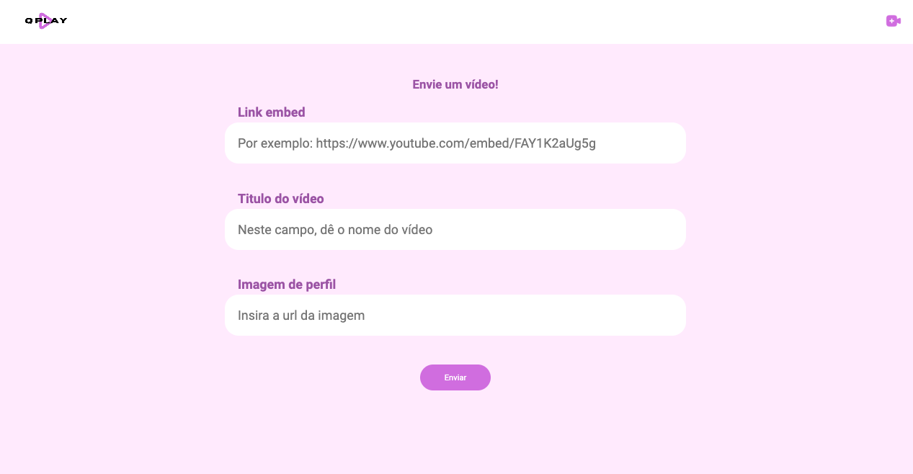
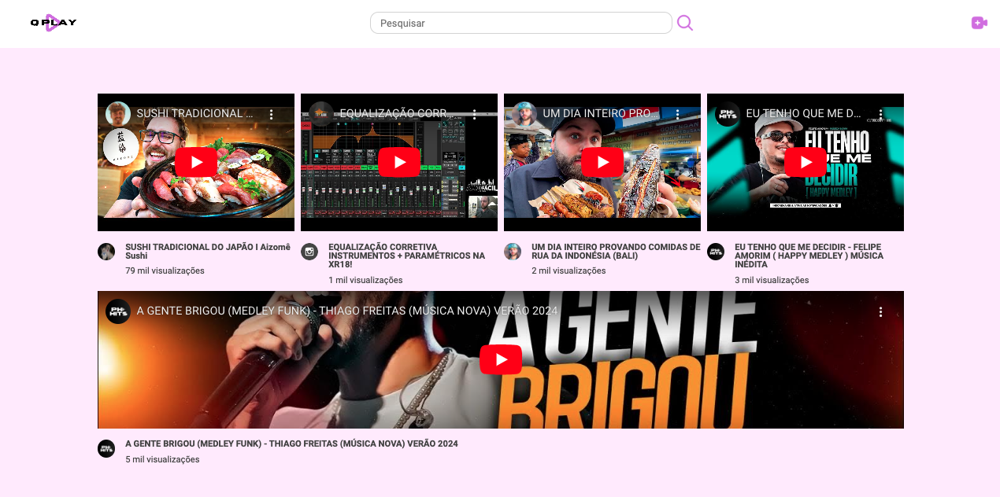

Página inicial e formulário de cadastro de vídeos da AluraPlay, uma plataforma de compartilhamento de vídeos.

## Tecnologias utilizadas no projeto
* HTML
* CSS
* Javascript
* NodeJS
* Json-server
## Screenshots

<table>
  <tr>
    <td>
     
    </td>
    <td>
      Feito por Gleidson Queiroz.</a> 🙋🏼‍♂️
    </td>
  </tr>
</table>